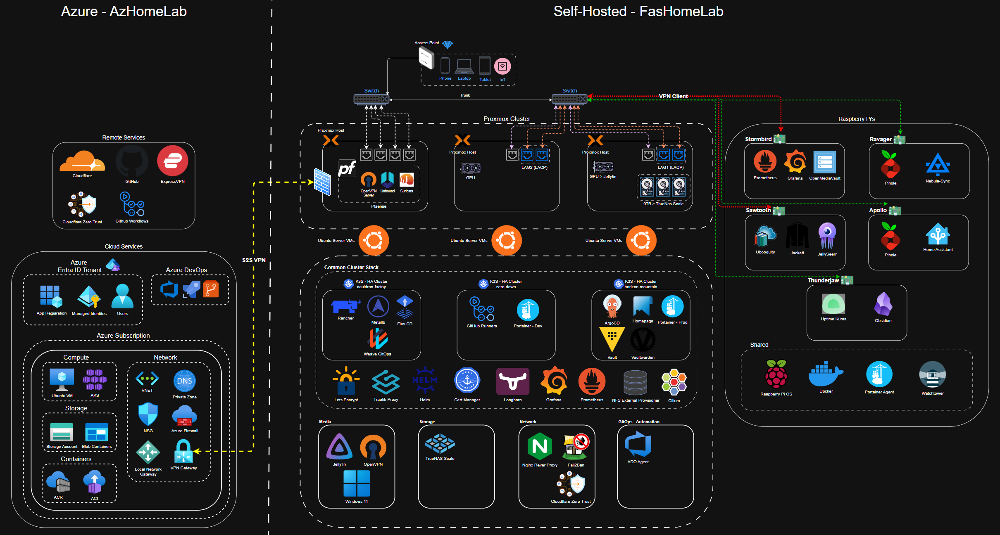
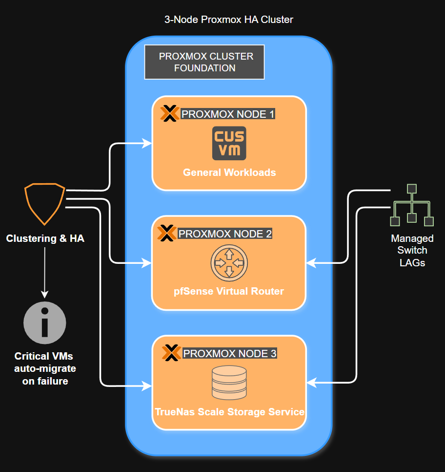
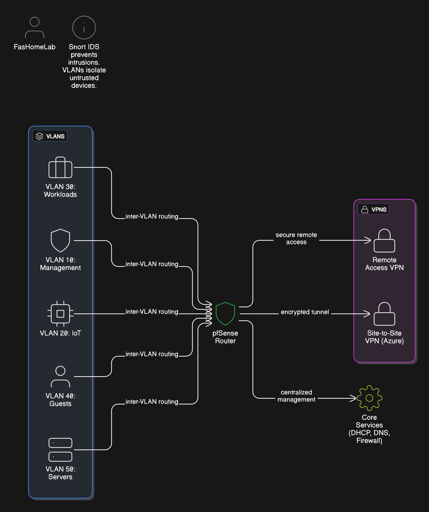
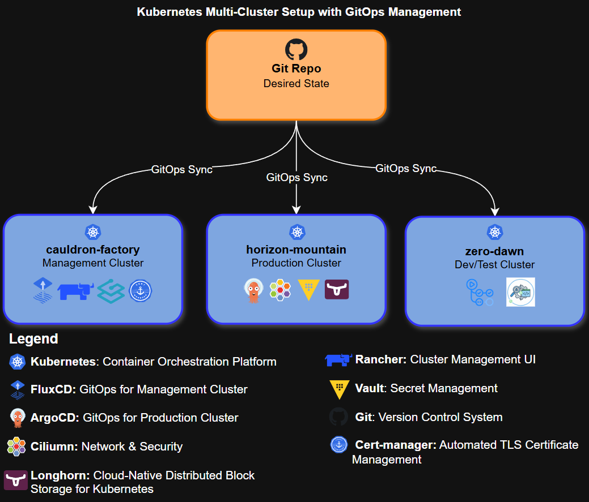
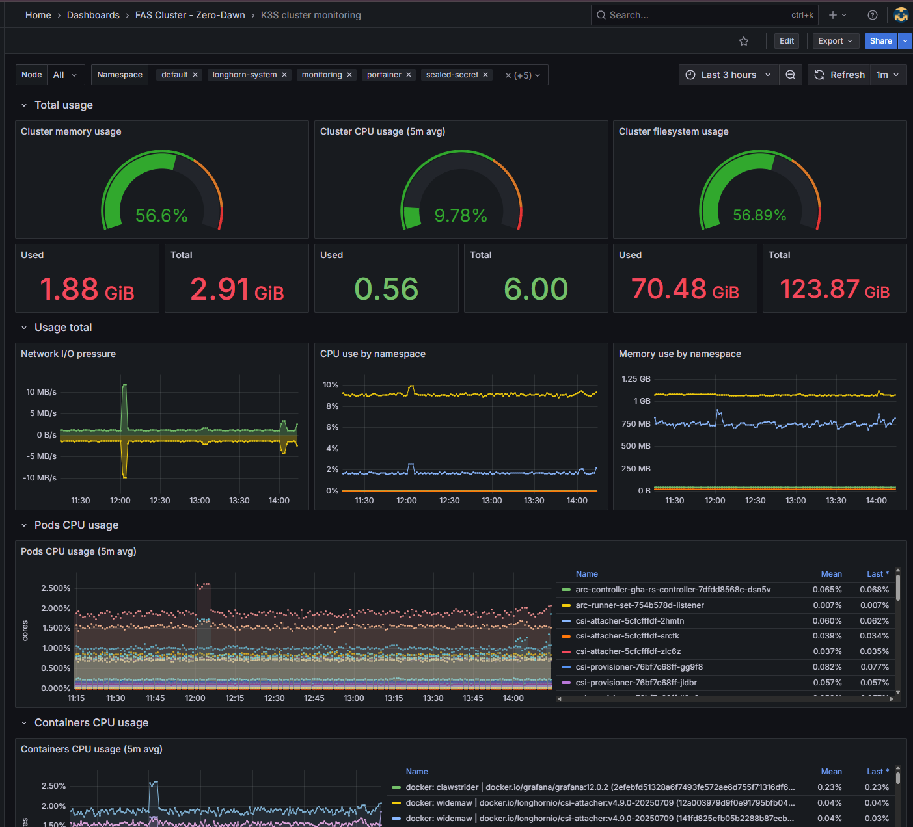
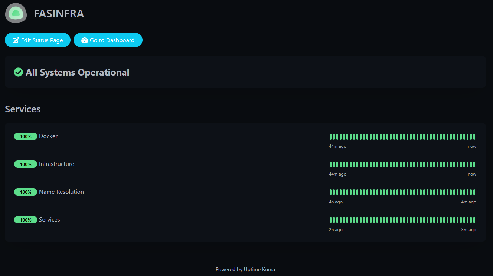

<a name="readme-top"></a>

# Project FasHomeLab: A Living DevOps and Platform Engineering Portfolio

[![LinkedIn][linkedin-shield]][linkedin-url]
## Executive Summary

This repository is the central hub for **Project FasHomeLab**, a comprehensive platform engineering portfolio. It showcases an enterprise-grade, fully automated homelab built on a foundation of Infrastructure as Code (IaC), GitOps, and robust security principles. The entire stack, from bare-metal provisioning to multi-cluster Kubernetes application deployments, is managed declaratively to demonstrate the skills of a modern **Platform Engineer**.

## 🏆 Key Results & Impact

This project translates technical solutions into measurable business value, achieving significant improvements in efficiency, security, and reliability.

* **⚡️ 90% Reduction in Deployment Time:** Reduced the time to provision and configure a new production-ready VM from **~2 hours** of manual work to **under 10 minutes** through a fully automated Terraform and Ansible pipeline.
* **⚙️ Scalable Management of 40+ Resources:** Declaratively manages the entire lifecycle of **20+ VMs**, **5 Raspberry Pis**, and **15+ containerized applications** across multiple environments, eliminating configuration drift.
* **🛡️ Centralized & Auditable Security:** Secured **100%** of Kubernetes secrets via GitOps with Sealed Secrets and managed **80%** of all infrastructure credentials in HashiCorp Vault, eliminating hardcoded secrets from the CI/CD process.
* **🔄 High-Availability by Design:** Engineered for resilience with a **3-node Proxmox HA cluster**, automated DNS failover using **Keepalived**, and weekly automated backups to ensure service continuity.

---

## 🗺️ High-Level Architecture & Workflow

This diagram illustrates the end-to-end workflow, from code commit to a fully provisioned and monitored application, demonstrating a complete CI/CD and GitOps lifecycle.

```mermaid
flowchart TD
    subgraph " "
        direction LR
        A[<br><b>Developer</b>]
    end

    subgraph "CI/CD & GitOps"
        direction LR
        B(fa:fagithub GitHub <br> Source Code <br> <i>Terraform, Ansible, K8s</i>)
        C{<br>GitHub Actions <br> <i>CI & Code Validation</i>}
        D(ado:azuredevops Azure DevOps <br> <i>CD Pipelines</i>)
        E(fa:fagithub GitHub <br> ArgoCD Manifests <br> <i>GitOps Source of Truth</i>)
    end
    
    subgraph "On-Premise Infrastructure (fashomelab)"
        direction TB
        F[<br>Proxmox HA Cluster]
        G(fa:fakubernetes Kubernetes Clusters <br> <i>horizon-mountain (prod) <br> zero-dawn (dev)</i>)
        H((fa:fadatabase5 Raspberry Pi <br> Fleet <br> <i>DNS, Monitoring, Storage</i>))
        I(vault:hashicorp Vault <br> Secrets Mgmt)
        J(fa:faansible Ansible <br> Config Mgmt)
    end
    
    subgraph "Cloud Infrastructure (Azure)"
        K(az:azure Azure Blob Storage <br> <i>Terraform State</i>)
        L(az:azure Other Azure Services <br> <i>VPN, ACR, AKS - Future</i>)
    end

    A -- Push Code --> B
    B -- Triggers --> C
    C -- Reports Status --> B
    B -- Webhook on Merge --> D
    D -- Executes Terraform <br> via self-hosted agent --> F
    D -- Executes Ansible <br> via self-hosted agent --> F & H
    D -- Updates --> E
    subgraph ArgoCD
    direction LR
    argo(argocd:argocd ArgoCD)
    end
    E -- Watched by --> argo
    argo -- Deploys Apps --> G
    
    F -- Provisioned by --> D
    F -- Hosts --> G & I
    K -- State Backend for --> D
    I -- Provides Secrets to --> D & G
    L -- Provisioned by --> D
    
    style A fill:#fff,stroke:#333,stroke-width:2px
    style argo fill:#fff,stroke:#333,stroke-width:2px
```

---

<details>
  <summary>Table of Contents</summary>
  <ol>
    <li><a href="#-about-the-project">About The Project</a></li>
    <li><a href="#️-overall-architecture">Overall Architecture</a></li>
    <li><a href="#️-tech-stack">Tech Stack</a></li>
    <li><a href="#-technical-deep-dive">Technical Deep Dive</a></li>
    <li><a href="#-devops-principles--skills-demonstrated">DevOps Principles & Skills Demonstrated</a></li>
    <li><a href="#️-repository-structure">Repository Structure</a></li>
    <li><a href="#️-roadmap">Roadmap</a></li>
    <li><a href="#-contact">Contact</a></li>
    <li><a href="#-acknowledgments">Acknowledgments</a></li>
  </ol>
</details>

## 🚀 About The Project

This project is the result of a long-standing passion for building automated systems, inspired by the complex worlds in games like *Horizon*. What began as a small cluster of Raspberry Pis for hands-on learning has evolved into the production-grade platform you see today.

My focus has been on automating everything from server builds to application deployments, allowing me to practice building the kind of resilient and secure infrastructure seen in professional environments.

**Key Goals:**
- Showcase a comprehensive skillset in infrastructure, cloud, and automation.
- Host resilient services for my own learning and experimentation.
- Automate everything possible via code for true repeatability.

**Explore the Code**: Check out [Terraform](https://github.com/fashomelab/homelab-terraform), [Ansible](https://github.com/fashomelab/ansible), or dive into issues to contribute!

<p align="right">(<a href="#readme-top">back to top</a>)</p>

## 🗺️ Overall Architecture

A hybrid setup: on-premise Proxmox cluster for core workloads, Raspberry Pi fleet for always-on services, and Azure for state/security. Click for full view.

<div align="center">
  <a href="images/homelab-architecture.png">
    
  </a>
  <p><em>Homelab Architecture Diagram.</em></p>
</div>

<p align="right">(<a href="#readme-top">back to top</a>)</p>

## 🛠️ Tech Stack

<p align="center">
  <strong>Virtualization & Networking:</strong><br>
  
  
  
  
  
</p>
<p align="center">
  <strong>Containerization & Orchestration:</strong><br>
  
  
  
  
  
  
</p>
<p align="center">
  <strong>Automation, IaC & CI/CD:</strong><br>
  
  
  
  
  
</p>
<p align="center">
  <strong>Cloud, Security & Observability:</strong><br>
  
  
  
  
</p>

<p align="right">(<a href="#readme-top">back to top</a>)</p>

## 🔍 Technical Deep Dive

<details>
  <summary><strong>Virtualization: 3-Node Proxmox HA Cluster</strong></summary>
  <br>
  The foundation of the on-premise lab is a 3-node Proxmox cluster, providing a resilient and flexible platform for all virtualized workloads.

  <ul>
    <li><strong>Clustering & High Availability:</strong> A 3-node setup was chosen to learn and implement enterprise-grade resilience. If one host fails, critical VMs can be automatically migrated to another node.</li>
    <li><strong>Network Teaming (LAGs):</strong> Link Aggregation is configured to the managed switch, preventing network bottlenecks and providing redundancy for the entire cluster.</li>
    <li><strong>Dedicated Workloads:</strong> A key design choice was to isolate workloads onto specific nodes for stability and performance. For example, <code>proxmox2</code> is dedicated to the virtualized <strong>pfSense router</strong> to protect core network functions, while <code>proxmox3</code> is tailored for storage-heavy services like <strong>TrueNAS Scale</strong>.</li>
  </ul>

  <div align="center">
    
    <p><em>Three-Node Proxmox HA Cluster Diagram.</em></p>
  </div>
</details>

<details>
  <summary><strong>Networking: pfSense, VLANs & Site-to-Site VPN</strong></summary>
  <br>
  A virtualized pfSense router acts as the brain of the network, managing security, routing, and traffic segmentation.

  <ul>
    <li><strong>Security-First Design:</strong> Virtualizing the firewall allows for easy snapshots, backups, and quick recovery. <strong>Snort</strong> is used for active intrusion detection, and the entire network is segmented into five <strong>VLANs</strong> to prevent lateral movement. For example, untrusted IoT devices are on a separate network and cannot access management interfaces.</li>
    <li><strong>VPN Gateway:</strong> The firewall functions as a central VPN gateway, providing two key capabilities: secure <strong>remote access</strong> into the homelab (as a VPN server), and a persistent <strong>site-to-site (S2S) tunnel</strong> to Microsoft Azure, securely bridging my on-premise and cloud environments.</li>
    <li><strong>Core Services:</strong> All essential network services (DHCP, DNS, firewall rules) are centralized on pfSense for simplified management.</li>
  </ul>

  <div align="center">
    
    <p><em>pfSense VLAN and VPN Network Architecture.</em></p>
  </div>
</details>

<details>
  <summary><strong>Kubernetes: Multi-Cluster GitOps Environment (k3s)</strong></summary>
  <br>
  The heart of my service deployment strategy is a multi-cluster Kubernetes environment. This setup mirrors enterprise best practices by separating management, production, and development workloads for enhanced security and stability. All clusters are managed declaratively using GitOps principles.

  <ol>
    <li><strong><code>cauldron-factory</code> (Management Cluster):</strong> This cluster follows the "management cluster" pattern, providing a central point of control. Managed by <strong>FluxCD</strong>, it hosts <strong>Rancher</strong> for UI-based management, along with core services like Traefik and Cert-Manager.</li>
    <li><strong><code>horizon-mountain</code> (Production Cluster):</strong> This cluster is dedicated to running primary, user-facing applications for the internal network. Managed by <strong>ArgoCD</strong>, it uses <strong>Cilium with BGP</strong> for advanced eBPF networking and includes a production-grade stack with <strong>HashiCorp Vault (HA)</strong> and <strong>Longhorn</strong> for storage. Access is strictly internal, protected from the public internet.</li>
    <li><strong><code>zero-dawn</code> (Dev/Test & CI Cluster):</strong> This cluster acts as a sandbox and hosts CI/CD infrastructure, including <strong>self-hosted GitHub Actions runners</strong>. This isolates resource-intensive build jobs from the production environment, ensuring performance and security.</li>
  </ol>

  <div align="center">
    
    <p><em>Multi-Cluster Kubernetes Setup with GitOps Management.</em></p>
  </div>
</details>

<details>
  <summary><strong>Physical Infrastructure: High-Availability Raspberry Pi Fleet</strong></summary>
  <br>
  To ensure critical services are always online without the power consumption of the main server cluster, a dedicated fleet of low-power Raspberry Pis runs 24/7. This is a deliberate design choice focused on energy efficiency and resilience.

  <ul>
    <li><strong><code>ravager</code> & <code>apollo</code> (HA DNS):</strong> DNS is the most critical service in the lab; if it's down, nothing works. This is a redundant <strong>Pi-hole</strong> setup in an active/passive cluster using <strong>Keepalived</strong> to manage a virtual IP for seamless failover.</li>
    <li><strong><code>thunderjaw</code> (External Monitoring):</strong> To provide a true external viewpoint, this Pi runs <strong>Uptime Kuma</strong>. It monitors all infrastructure from outside the main cluster, ensuring I get alerts even if the primary network or hosts are down.</li>
    <li><strong><code>sawtooth</code> (Isolated I/O Workloads):</strong> This node is dedicated to a high-volume data ingestion workload, keeping this high-churn activity separate from the main storage arrays to protect their performance.</li>
    <li><strong><code>stormbird</code> (Tiered Storage & Central Monitoring):</strong> Runs <strong>OpenMediaVault</strong> as a fast staging area for data, which is then synced nightly to the main TrueNAS VM. It also hosts the central <strong>Prometheus</strong> & <strong>Grafana</strong> "single pane of glass" for the entire lab.</li>
  </ul>

  <div align="center">
    
    <p><em>Cluster Usage Monitoring with Grafana on stormbird.</em></p>
  </div>

  <div align="center">
    
    <p><em>Uptime Kuma Monitoring for thunderjaw.</em></p>
  </div>
</details>

<details>
  <summary><strong>Automation: IaC & Hybrid Cloud Strategy</strong></summary>
  <br>
  Automation is the central principle of this lab, with a clear separation of concerns between provisioning (Terraform) and configuration (Ansible).

  <ul>
    <li><strong>Terraform (IaC):</strong> Manages the entire lifecycle of all Proxmox VMs, with state stored securely in <strong>Azure Blob Storage</strong> to enable CI/CD integration. [View the Terraform repository here](https://github.com/fashomelab/homelab-terraform).</li>
    <li><strong>Ansible (Configuration Management):</strong> Configures new VMs after provisioning, handling security hardening and application setup. Playbooks are triggered automatically by an <strong>Azure DevOps</strong> pipeline.</li>
    <li><strong>Azure Cloud Services:</strong> An <strong>Entra ID App Registration</strong> provides secure, passwordless authentication for all automated services (Terraform, ADO) interacting with the Azure subscription.</li>
  </ul>
</details>

<p align="right">(<a href="#readme-top">back to top</a>)</p>

## 💡 DevOps Principles & Skills Demonstrated

This project puts the following key DevOps principles and engineering skills into practice:
* **Infrastructure as Code (IaC):** Using **Terraform** to declaratively manage all virtual infrastructure.
* **GitOps:** Using **ArgoCD** and **FluxCD** to manage Kubernetes cluster state and application deployments directly from Git.
* **Configuration Management:** Using **Ansible** for repeatable and consistent server configuration and software deployment.
* **CI/CD Automation:**
    * Implementing validation workflows in **GitHub Actions**.
    * Using **Azure DevOps Pipelines** for infrastructure update automation.
    * Building and managing **self-hosted CI runners** on Kubernetes.
* **Containerization & Orchestration:** Deep expertise in **Docker** and **Kubernetes (k3s)**, including advanced networking (**Cilium**), storage (**Longhorn**), and security (**Sealed Secrets**, **Vault**).
* **Hybrid-Cloud Management:** Seamlessly managing resources across on-premise (**Proxmox**, Raspberry Pis) and cloud platforms (**Azure**).
* **Observability:** Building a comprehensive, multi-layered monitoring stack with **Prometheus**, **Grafana**, and **Uptime Kuma**.
* **Network Security:** Implementing network segmentation with **VLANs**, enterprise-grade firewalls with **pfSense/Snort**, and robust secrets management.

<p align="right">(<a href="#readme-top">back to top</a>)</p>

## 🏆 Key Achievements

* **Fully Automated Provisioning:** Reduced the time to deploy a new, fully configured Proxmox VM from over 30 minutes of manual work to under 5 minutes using Terraform and Ansible.
* **Zero-Downtime Deployments:** Implemented a GitOps workflow with ArgoCD, enabling consistent and reliable application deployments to the production Kubernetes cluster.
* **Enhanced Security Posture:** Eliminated all long-lived secrets from the CI/CD process by implementing a secure, OIDC-based authentication flow with HashiCorp Vault.

## 🏗️ Repository Structure

Central hub for the project. Private repos will go public soon:

- **[Terraform IaC](https://github.com/fashomelab/homelab-terraform):** Contains all Infrastructure as Code for both on-premise (Proxmox) and cloud (Azure) environments.
- **[Ansible](https://github.com/fashomelab/ansible)**: Playbooks and roles for configuration management. Automates Proxmox VMs and Raspberry Pis with dynamic inventories and Vault integration.
- **/kubernetes:** Manifests, Helm, GitOps configs.

<p align="right">(<a href="#readme-top">back to top</a>)</p>

## 🗺️ Roadmap

My focus for this project is on continuous improvement. Here is a high-level overview of my completed milestones and future goals.

### ✅ Completed

* **Infrastructure as Code (Terraform):**
    * [x] Built a fully automated, multi-environment infrastructure for both on-premise (Proxmox) and cloud (Azure) platforms.
    * [x] Implemented a secure, secretless CI/CD pipeline in GitHub Actions for complete validation of all Terraform code.
    * [x] Centralized secrets management for Terraform with a self-hosted HashiCorp Vault instance.

* **Ansible & Configuration Management:**
    * [x] **CI for Ansible:** Created a dedicated CI/CD pipeline to lint and validate all Ansible roles and playbooks.
    * [x] **Centralize Ansible Secrets:** Migrated all secrets from Ansible Vault into HashiCorp Vault for a single source of truth.

### 🚀 Next Up: Configuration Management & GitOps

Now that the foundational infrastructure and configuration layers are automated, my next focus is on GitOps and advanced orchestration.

* **Ansible & Configuration Management:**
    * [ ] **Unified Provisioning Workflow:** Integrate the Terraform and Ansible pipelines for a seamless, end-to-end server provisioning and configuration process.

* **Kubernetes & GitOps:**
    * [ ] **CI for Kubernetes:** Expand the CI/CD pipeline to include validation for all Kubernetes manifests.
    * [ ] **Implement a Service Mesh (Istio/Linkerd):** Enhance security and observability within the Kubernetes clusters by adding a service mesh for mTLS and traffic management.

<p align="right">(<a href="#readme-top">back to top</a>)</p>

## 📞 Contact

Corne Blignaut - [LinkedIn](https://www.linkedin.com/in/corne-blignaut-10b618a4) - cblignaut989@hotmail.com

Project: [https://github.com/fashomelab/corneb](https://github.com/fashomelab/corneb)

<p align="right">(<a href="#readme-top">back to top</a>)</p>

## 🙏 Acknowledgments

- [Best-README-Template](https://github.com/othneildrew/Best-README-Template) for README inspiration.
- /r/homelab and /r/selfhosted communities for ideas and support.
- Official docs for Proxmox, Terraform, Kubernetes, Ansible, and HashiCorp Vault.

<p align="right">(<a href="#readme-top">back to top</a>)</p>

[linkedin-shield]: https://img.shields.io/badge/-LinkedIn-black.svg?style=for-the-badge&logo=linkedin&colorB=555
[linkedin-url]: https://www.linkedin.com/in/corne-blignaut-10b618a4
[status-shield]: https://img.shields.io/badge/status-active-success.svg?style=for-the-badge
[status-url]: https://github.com/fashomelab/corneb/actions?query=workflow%3Aaggregate-ci