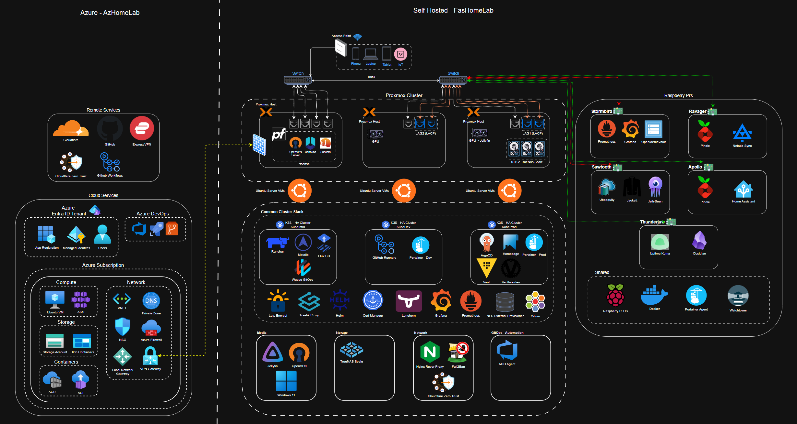

[![LinkedIn][linkedin-shield]][linkedin-url]
[![Project Status][status-shield]][status-url]

 

  

  <h3 align="center">Project Corneb: A DevOps Homelab Showcase</h3>

  

    A comprehensive homelab environment demonstrating modern DevOps and infrastructure engineering principles. This project showcases automation, containerization, Infrastructure as Code, and hybrid-cloud practices across a multi-node, multi-platform setup.
     
    <a href="#-overall-architecture"><strong>Explore the Architecture »</strong></a>
     
     
    <a href="https://github.com/fashomelab/corneb/issues">Report Bug</a>
    ·
    <a href="https://github.com/fashomelab/corneb/issues">Request Feature</a>
  

  
Table of Contents

  <ol>
    <li><a href="#-about-the-project">About The Project</a></li>
    <li><a href="#-overall-architecture">Overall Architecture</a></li>
    <li>
      <a href="#-technical-deep-dive">Technical Deep Dive</a>
      <ul>
        <li><a href="#virtualization-proxmox-ve-cluster">Virtualization: Proxmox VE Cluster</a></li>
        <li><a href="#networking-pfsense--vlans">Networking: pfSense & VLANs</a></li>
        <li><a href="#kubernetes-k3s-clusters">Kubernetes (k3s) Clusters</a></li>
        <li><a href="#physical-infrastructure-raspberry-pi-fleet">Physical Infrastructure: Raspberry Pi Fleet</a></li>
        <li><a href="#automation-iac--configuration-management">Automation: IaC & Configuration Management</a></li>
        <li><a href="#cloud-integration-azure">Cloud Integration: Azure</a></li>
      </ul>
    </li>
    <li><a href="#-devops-principles--skills-demonstrated">DevOps Principles & Skills Demonstrated</a></li>
    <li><a href="#-repository-structure">Repository Structure</a></li>
    <li><a href="#-roadmap">Roadmap</a></li>
    <li><a href="#-contact">Contact</a></li>
    <li><a href="#-acknowledgments">Acknowledgments</a></li>
  </ol>

## 🚀 About The Project

Project Corneb is my personal homelab, designed and built to serve as a practical, hands-on environment for implementing and mastering modern DevOps practices. It encompasses on-premise virtualization, a sophisticated container orchestration platform, robust networking, and a hybrid-cloud model for state and service management.

This isn't just a collection of services; it's a fully-fledged, automated ecosystem managed almost entirely through code. From provisioning virtual machines with Terraform to deploying applications on Kubernetes with GitOps, this project demonstrates a deep understanding of the entire technology lifecycle.

The primary goals of this project are to:
* **Showcase** a comprehensive skillset in infrastructure engineering, cloud, and automation.
* **Create** a resilient and scalable environment for self-hosting services and developing new skills.
* **Automate** everything possible, from initial server builds to application deployment and infrastructure updates.

(<a href="#readme-top">back to top</a>)

## 🗺️ Overall Architecture

The entire homelab is designed for resilience, security, and separation of concerns. The diagram below provides a high-level overview of the two main environments: the self-hosted on-premise lab (`FashHomeLab`) and the cloud backend (`AzHomeLab`).

* **To see the detailed, full-resolution diagram, please click on the image below.**

  

(<a href="#readme-top">back to top</a>)

## 🛠️ Technical Deep Dive

### Virtualization: Proxmox VE Cluster
The foundation of the on-premise lab is a 3-node Proxmox cluster configured for high availability.
* **Clustering & High Availability:** Ensures resilience and workload distribution.
* **Network Teaming (LAGs):** Link Aggregation is configured for increased throughput and redundancy to the managed switch.
* **Workload Distribution:**
    * `proxmox`: Hosts several k3s cluster nodes and the Nginx reverse proxy.
    * `proxmox2`: A dedicated node for the virtualized **pfSense router**, isolating core network functions.
    * `proxmox3`: Hosts the remaining k3s nodes, a **TrueNAS Scale** instance (with HDD/SSD passthrough), a Windows 11 VM for media, and a self-hosted Azure DevOps agent.

### Networking: pfSense & VLANs
Security and traffic segmentation are managed by a virtualized pfSense router.
* **VLANs:** Five distinct VLANs are configured to isolate different types of traffic (e.g., management, services, IoT, trusted clients), enhancing security.
* **IDS/IPS:** **Snort** is deployed for intrusion detection and prevention, actively monitoring traffic for threats.
* **Core Services:** Manages DHCP, DNS, and firewall rules for the entire network.

### Kubernetes (k3s) Clusters
The heart of the service deployment strategy is Kubernetes, implemented via three distinct k3s clusters managed with GitOps principles.

1.  **`cauldron-factory` (Management Cluster):**
    * **Purpose:** Manages the other clusters and core cluster services.
    * **GitOps:** Managed by **FluxCD**.
    * **Stack:** Hosts **Rancher UI**, Traefik Ingress, Reflector, and Cert-Manager, all deployed via Helm charts managed by Flux.

2.  **`horizon-mountain` (Production Cluster):**
    * **Purpose:** Runs primary, user-facing applications.
    * **GitOps:** Managed by **ArgoCD** using a combination of Helm and Kustomize.
    * **CNI:** Utilizes **Cilium** with **BGP** for advanced networking and security, replacing the need for MetalLB.
    * **Stack:** Traefik, Cert-Manager, **HashiCorp Vault (HA Mode)**, Vaultwarden, Homepage Dashboard, **Longhorn** for persistent storage, and a full monitoring stack (Prometheus Operator, Grafana).
    * **Security:** Secrets are encrypted using **Sealed Secrets** before being committed to Git.

3.  **`zero-dawn` (Dev/Test & CI Cluster):**
    * **Purpose:** A testing ground for new applications and host for CI/CD infrastructure.
    * **GitOps:** Also managed by **ArgoCD**.
    * **Stack:** A similar stack to 'prod' (Traefik, Longhorn, Sealed Secrets, Monitoring) to maintain environment parity.
    * **CI/CD:** Hosts **self-hosted GitHub Actions runners**, connected securely via a GitHub App.

### Physical Infrastructure: Raspberry Pi Fleet
A fleet of low-power Raspberry Pis runs essential 24/7 services, allowing the main Proxmox hosts to be powered down to save energy.

* **`ravager` & `apollo` (DNS):** A redundant, high-availability DNS setup using **Pi-hole**. `ravager` is the primary, with `apollo` as the secondary. State is synchronized with `Nebulasync` and failover is handled by `Keepalived`.
* **`thunderjaw` (External Monitoring):** Runs **Uptime Kuma** to monitor all infrastructure, providing an external viewpoint.
* **`sawtooth` (Download Services):** A suite of Docker containers for automated media acquisition (Sonarr, Radarr, qBittorrent).
* **`stormbird` (Storage & Central Monitoring):**
    * **NAS:** Runs **OpenMediaVault** for fast Docker volume storage and acts as a staging area for downloads. Data is synced nightly to the main TrueNAS Scale VM.
    * **Central Monitoring Hub:** Hosts a central **Prometheus** and **Grafana** instance. Node Exporters, deployed via Ansible, feed metrics from every host and VM into this instance. It also pulls in data from the Kubernetes Prometheus instances, providing a single pane of glass for all metrics and alerting.

### Automation: IaC & Configuration Management

* **Terraform (Infrastructure as Code):**
    * **Scope:** Manages the entire lifecycle of all Proxmox VMs.
    * **Remote Backend:** Securely stores the Terraform state file in **Azure Blob Storage**.
    * **Structure:** Highly modular and organized by environment (`fashomelab`, `azhomelab`).
    * *(Future Public Repo: `github.com/fashomelab/terraform`)*

* **Ansible (Configuration Management):**
    * **Scope:** Configures new VMs post-provisioning, manages ongoing server state, and deploys monitoring agents.
    * **Playbooks:** Includes roles for hardening (UFW, Fail2Ban), Nginx setup, Let's Encrypt certificates, software installation, and system-wide updates.
    * **Secrets:** Currently uses Ansible Vault, with plans to migrate to HashiCorp Vault.
    * **CI/CD:** An Azure DevOps pipeline triggers the `infra_update` playbook from a self-hosted agent.
    * *(Future Public Repo: `github.com/fashomelab/ansible`)*

### Cloud Integration: Azure
* **Terraform Backend:** Azure Blob Storage is used for remote state management, a best practice for collaboration and CI/CD pipelines.
* **Authentication:** An **App Registration** in Microsoft Entra ID acts as a Service Principal, allowing for secure, passwordless authentication from Terraform and other services to Azure.

(<a href="#readme-top">back to top</a>)

## 💡 DevOps Principles & Skills Demonstrated

This project is a living portfolio of key DevOps principles and engineering skills:

* **Infrastructure as Code (IaC):** Using **Terraform** to declaratively manage all virtual infrastructure.
* **GitOps:** Using **ArgoCD** and **FluxCD** to manage Kubernetes cluster state and application deployments directly from Git.
* **Configuration Management:** Using **Ansible** for repeatable and consistent server configuration and software deployment.
* **CI/CD:**
    * Implementing CI workflows in **GitHub Actions** for linting and validating code.
    * Using **Azure DevOps Pipelines** for infrastructure update automation.
    * Building and managing **self-hosted CI runners** on Kubernetes.
* **Containerization & Orchestration:** Deep expertise in **Docker** and **Kubernetes (k3s)**, including networking (**Cilium**), storage (**Longhorn**), and security (**Sealed Secrets**, **Vault**).
* **Hybrid Environment Management:** Seamlessly managing resources across on-premise (**Proxmox**, physical hardware) and cloud platforms (**Azure**).
* **Monitoring & Observability:** Building a comprehensive, multi-layered monitoring stack with **Prometheus**, **Grafana**, and **Uptime Kuma**.
* **Networking & Security:**
    * Implementing network segmentation with **VLANs**.
    * Configuring enterprise-grade firewall and IDS/IPS with **pfSense** and **Snort**.
    * Managing secrets securely with **Ansible Vault**, **Sealed Secrets**, and **HashiCorp Vault**.
* **Version Control (Git):** All code, configurations, and documentation are version-controlled in Git, serving as the single source of truth.

(<a href="#readme-top">back to top</a>)

## 🏗️ Repository Structure

This `corneb` repository serves as the central hub and public-facing entry point for my homelab project. As I clean up and document my other private repositories, they will be made public and linked from here.

* **/terraform:** (Private, to be made public) Contains all Terraform code for Proxmox and Azure.
* **/ansible:** (Private, to be made public) Contains all Ansible playbooks and roles.
* **/kubernetes:** (Private, to be made public) Contains Kubernetes manifests, Helm charts, and GitOps configurations.
* **`homelab-architecture.png`:** The architecture diagram for this project.

(<a href="#readme-top">back to top</a>)

## 🗺️ Roadmap

* [ ] **Integrate Terraform & Ansible:** Create a unified workflow where Terraform provisions a VM and then automatically triggers an Ansible playbook to configure it.
* [ ] **Enhance CI Pipelines:** Implement CI for the Ansible and Terraform repos to automatically format, lint, and validate code on every push, creating PRs for suggested changes.
* [ ] **Migrate to HashiCorp Vault:** Move all secrets from Ansible Vault to the central HashiCorp Vault instance for dynamic secret management.
* [ ] **Implement Continuous Deployment (CD):** Develop a CD pipeline to automatically deploy approved application changes to the Kubernetes clusters.
* [ ] **Publish Sub-Repositories:** Clean up, document, and publish the `terraform`, `ansible`, and `kubernetes` repositories.

(<a href="#readme-top">back to top</a>)

## 📞 Contact

Your Name - [Your LinkedIn Profile URL] - your.email@example.com

Project Link: [https://github.com/fashomelab/corneb](https://github.com/fashomelab/corneb)

(<a href="#readme-top">back to top</a>)

## 🙏 Acknowledgments

A list of resources that have been invaluable in this journey:

* [Best-README-Template](https://github.com/othneildrew/Best-README-Template)
* The /r/homelab and /r/selfhosted communities
* Documentation for Proxmox, Terraform, Kubernetes, Ansible, and all the incredible open-source projects used here.

(<a href="#readme-top">back to top</a>)

[linkedin-shield]: https://img.shields.io/badge/-LinkedIn-black.svg?style=for-the-badge&logo=linkedin&colorB=555
[linkedin-url]: www.linkedin.com/in/corne-blignaut-10b618a  [status-shield]: https://img.shields.io/badge/status-active-success.svg?style=for-the-badge
[status-url]: https://github.com/fashomelab/corneb