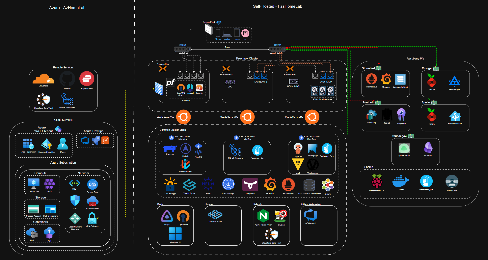

[![LinkedIn][linkedin-shield]][linkedin-url]
[![Project Status][status-shield]][status-url]

 

  
  <h3 align="center">Project FasHomeLab: A Living DevOps and Platform Engineering Portfolio</h3>
  

    Welcome to FasHomeLab. This repository is the central hub for my personal homelab, a fully automated platform designed to practice and demonstrate modern DevOps and cloud engineering principles. From Infrastructure as Code with Terraform to GitOps on Kubernetes, this project is a living portfolio of my skills and passion for building resilient, code-driven systems.
     
    <a href="#-overall-architecture"><strong>Explore the Architecture »</strong></a>
     
     
    <a href="https://github.com/fashomelab/corneb/issues">Report Bug</a>
    ·
    <a href="https://github.com/fashomelab/corneb/issues">Request Feature</a>
  

  
Table of Contents

  <ol>
    <li><a href="#-about-the-project">About The Project</a></li>
    <li><a href="#-overall-architecture">Overall Architecture</a></li>
    <li>
      <a href="#-technical-deep-dive">Technical Deep Dive</a>
      <ul>
        <li><a href="#virtualization-proxmox-ve-cluster">Virtualization: Proxmox VE Cluster</a></li>
        <li><a href="#networking-pfsense--vlans">Networking: pfSense & VLANs</a></li>
        <li><a href="#kubernetes-k3s-clusters">Kubernetes (k3s) Clusters</a></li>
        <li><a href="#physical-infrastructure-raspberry-pi-fleet">Physical Infrastructure: Raspberry Pi Fleet</a></li>
        <li><a href="#automation-iac--configuration-management">Automation: IaC & Configuration Management</a></li>
        <li><a href="#cloud-integration-azure">Cloud Integration: Azure</a></li>
      </ul>
    </li>
    <li><a href="#-devops-principles--skills-demonstrated">DevOps Principles & Skills Demonstrated</a></li>
    <li><a href="#-repository-structure">Repository Structure</a></li>
    <li><a href="#-roadmap">Roadmap</a></li>
    <li><a href="#-contact">Contact</a></li>
    <li><a href="#-acknowledgments">Acknowledgments</a></li>
  </ol>

## 🚀 About The Project

This project comes from my passion for technology and for getting hands-on with modern DevOps tools. Before this was a portfolio, it was just my personal lab for learning and testing new ideas. It started small with a few Raspberry Pis and has grown into the setup you see here.

As the lab got bigger, my main goal became to automate everything. This project shows how I put that idea into practice. I use tools like Terraform to create VMs and GitOps to manage my Kubernetes clusters, showing a real-world understanding of how to build and manage infrastructure.

The primary goals of this project are to:
* **Showcase** a comprehensive skillset in infrastructure engineering, cloud, and automation.
* **Create** a resilient and scalable environment for self-hosting services and developing new skills.
* **Automate** everything possible, from initial server builds to application deployment and infrastructure updates.

(<a href="#readme-top">back to top</a>)

## 🗺️ Overall Architecture

This homelab is a hybrid environment built for resilience and security. The core infrastructure is self-hosted on-premise, while Microsoft Azure provides key backend services for state management. The diagram below shows how these components work together.

*Click the diagram for a full-resolution view.*

  

(<a href="#readme-top">back to top</a>)

## 🛠️ Technical Deep Dive

### Virtualization: Proxmox VE Cluster
The foundation of the on-premise lab is a 3-node Proxmox cluster, providing a resilient and flexible platform for all virtualized workloads.
* **Clustering & High Availability:** A 3-node setup was chosen to learn and implement enterprise-grade resilience. If one host fails, critical VMs can be automatically migrated to another node.
* **Network Teaming (LAGs):** Link Aggregation is configured to the managed switch, preventing network bottlenecks and providing redundancy for the entire cluster.
* **Dedicated Workloads:**
    * `proxmox2` is dedicated to the virtualized **pfSense router**, a design choice to isolate core network functions from other workloads for maximum stability and security.
    * `proxmox3` is tailored for storage-heavy services, using direct HDD/SSD passthrough for the **TrueNAS Scale** instance.

### Networking: pfSense & VLANs
A virtualized pfSense router acts as the brain of the network, managing security, routing, and traffic segmentation.
* **Security-First Design:** Virtualizing the firewall allows for easy snapshots, backups, and quick recovery. **Snort** is used for active intrusion detection, and the entire network is segmented into five **VLANs** to prevent lateral movement. For example, untrusted IoT devices are on a separate network and cannot access management interfaces.
* **VPN Gateway:** The firewall functions as a central VPN gateway, providing two key capabilities: secure **remote access** into the homelab (as a VPN server), and a persistent **site-to-site (S2S) tunnel** to Microsoft Azure, securely bridging my on-premise and cloud environments.
* **Core Services:** All essential network services (DHCP, DNS, firewall rules) are centralized on pfSense for simplified management.

### Kubernetes (k3s) Clusters
The heart of my service deployment strategy is a multi-cluster Kubernetes environment. This setup mirrors enterprise best practices by separating management, production, and development workloads for enhanced security and stability. All clusters are managed declaratively using GitOps principles.

1.  **`cauldron-factory` (Management Cluster):**
    * **Purpose:** This cluster follows the "management cluster" pattern, providing a central point of control. Its primary role is to manage other clusters and core infrastructure services.
    * **GitOps & Stack:** Managed by **FluxCD** to explore both major GitOps tools. It hosts **Rancher** for UI-based management, along with core services like Traefik and Cert-Manager.

2.  **`horizon-mountain` (Production Cluster):**
    * **Purpose:** Runs primary, user-facing applications for the internal home network.
    * **GitOps & Advanced Networking:** Managed by **ArgoCD**. I chose **Cilium with BGP** to gain deep experience with eBPF-based networking and to enable advanced features like direct pod-to-pod routing across my network.
    * **Production-Grade Stack:** Includes **HashiCorp Vault in HA mode** for robust secrets management, **Longhorn** for resilient persistent storage, and a full Prometheus/Grafana monitoring stack.
    * **Security & Access:** This cluster is intentionally not exposed to the public internet. Access to its services is strictly internal, ensuring that core infrastructure like HashiCorp Vault is protected from external threats. External access to specific, approved applications is managed through a separate, hardened Nginx reverse proxy and Traefik ingress controller.

3.  **`zero-dawn` (Dev/Test & CI Cluster):**
    * **Purpose:** A testing ground for new applications and host for CI/CD infrastructure.
    * **GitOps & Environment Parity:** Also managed by **ArgoCD**. The stack is kept similar to the production cluster to ensure that applications behave the same way in testing as they do in production, a key DevOps principle.
    * **Isolated CI/CD Workloads:** This cluster is the designated home for all CI/CD infrastructure, including the self-hosted GitHub Actions runners. This is a deliberate design choice that isolates resource-intensive build jobs from the production environment, ensuring application performance is never impacted by CI workloads. It also creates a crucial security boundary between the build system and production services.

### Physical Infrastructure: Raspberry Pi Fleet
To ensure critical services are always online without the power consumption of the main server cluster, a dedicated fleet of low-power Raspberry Pis runs 24/7. This is a deliberate design choice focused on energy efficiency and resilience.

* **`ravager` & `apollo` (High-Availability DNS):** DNS is the most critical service in the lab; if it's down, nothing works. This is a redundant **Pi-hole** setup in an active/passive cluster using **Keepalived** to manage a virtual IP for seamless failover. State and configurations are kept in sync with `Nebulasync`.
* **`thunderjaw` (External Monitoring):** To provide a true external viewpoint, this Pi runs **Uptime Kuma**. It monitors all infrastructure from outside the main cluster, ensuring I get alerts even if the primary network or hosts are down.
* **`sawtooth` (Download Services):** This node is dedicated to a **high-volume data ingestion workload** using a suite of containerized automation tools. This isolates the high I/O churn of this process, protecting the performance and integrity of the main storage arrays.
* **`stormbird` (Staging Storage & Central Monitoring):**
    * **Tiered Storage:** Runs **OpenMediaVault** as a fast, temporary NAS for Docker volumes and as a staging area for downloads. Data is then synced nightly to the main TrueNAS VM, a tiered approach that protects the primary ZFS pool from constant writes.
    * **Single Pane of Glass:** Hosts a central **Prometheus** and **Grafana** instance. Node Exporters, deployed via Ansible, feed metrics from every device in the lab into this hub, providing a single dashboard for all metrics and alerting.

### Automation & Hybrid Cloud Strategy
Automation is the central principle of this lab, with a clear separation of concerns between provisioning (Terraform) and configuration (Ansible). This entire workflow is built on a hybrid-cloud model, using Azure for critical backend services.

* **Terraform (Infrastructure as Code):**
    * **Lifecycle Management:** Manages the entire lifecycle of all Proxmox VMs, from creation to destruction, ensuring infrastructure is declarative and repeatable.
    * **Secure State Management:** The Terraform state file is stored securely in **Azure Blob Storage**. This is a best practice that enables CI/CD integration and prevents state file loss.
    * *(Future Public Repo: `github.com/fashomelab/terraform`)*

* **Ansible (Configuration Management):**
    * **Server Configuration:** Configures new VMs after they are provisioned by Terraform. Playbooks handle everything from security hardening (UFW, Fail2Ban) to application setup.
    * **GitOps for Infrastructure:** An **Azure DevOps** pipeline automatically triggers Ansible playbooks from a self-hosted agent, applying GitOps principles to infrastructure configuration.
    * **Secrets Management:** Currently uses Ansible Vault for static secrets, with a roadmap item to integrate with the central HashiCorp Vault for dynamic secret injection.
    * *(Future Public Repo: `github.com/fashomelab/ansible`)*

* **Azure Cloud Services:**
    * **Authentication:** A Microsoft Entra ID **App Registration** acts as a Service Principal, providing secure, passwordless authentication for all automated services (like Terraform and ADO) that need to interact with my Azure subscription.

(<a href="#readme-top">back to top</a>)

## 💡 DevOps Principles & Skills Demonstrated

This project puts the following key DevOps principles and engineering skills into practice:

* **Infrastructure as Code (IaC):** Using **Terraform** to declaratively manage all virtual infrastructure.
* **GitOps:** Using **ArgoCD** and **FluxCD** to manage Kubernetes cluster state and application deployments directly from Git.
* **Configuration Management:** Using **Ansible** for repeatable and consistent server configuration and software deployment.
* **CI/CD:**
    * Implementing CI workflows in **GitHub Actions** for linting and validating code.
    * Using **Azure DevOps Pipelines** for infrastructure update automation.
    * Building and managing **self-hosted CI runners** on Kubernetes.
* **Containerization & Orchestration:** Deep expertise in **Docker** and **Kubernetes (k3s)**, including networking (**Cilium**), storage (**Longhorn**), and security (**Sealed Secrets**, **Vault**).
* **Hybrid Environment Management:** Seamlessly managing resources across on-premise (**Proxmox**, physical hardware) and cloud platforms (**Azure**).
* **Monitoring & Observability:** Building a comprehensive, multi-layered monitoring stack with **Prometheus**, **Grafana**, and **Uptime Kuma**.
* **Networking & Security:**
    * Implementing network segmentation with **VLANs**.
    * Configuring enterprise-grade firewall and IDS/IPS with **pfSense** and **Snort**.
    * Managing secrets securely with **Ansible Vault**, **Sealed Secrets**, and **HashiCorp Vault**.
* **Version Control (Git):** All code, configurations, and documentation are version-controlled in Git, serving as the single source of truth.

(<a href="#readme-top">back to top</a>)

## 🏗️ Repository Structure

This `corneb` repository serves as the central hub and public-facing entry point for my homelab project. As I clean up and document my other private repositories, they will be made public and linked from here.

* **/terraform:** (Private, to be made public) Contains all Terraform code for Proxmox and Azure.
* **/ansible:** (Private, to be made public) Contains all Ansible playbooks and roles.
* **/kubernetes:** (Private, to be made public) Contains Kubernetes manifests, Helm charts, and GitOps configurations.
* **`homelab-architecture.png`:** The architecture diagram for this project.

(<a href="#readme-top">back to top</a>)

## 🗺️ Roadmap

* [ ] **Integrate Terraform & Ansible:** Create a unified workflow where Terraform provisions a VM and then automatically triggers an Ansible playbook to configure it.
* [ ] **Enhance CI Pipelines:** Implement CI for the Ansible and Terraform repos to automatically format, lint, and validate code on every push.
* [ ] **Migrate to HashiCorp Vault:** Move all secrets from Ansible Vault to the central HashiCorp Vault instance for dynamic secret management.
* [ ] **Implement Continuous Deployment (CD):** Develop a CD pipeline to automatically deploy approved application changes to the Kubernetes clusters.
* [ ] **Implement a Service Mesh:** Explore and deploy a service mesh like Istio or Linkerd to manage inter-service communication within the Kubernetes clusters.

(<a href="#readme-top">back to top</a>)

## 📞 Contact

Your Name - [https://www.linkedin.com/in/corne-blignaut-10b618a4] - cblignaut989@hotmail.com

Project Link: [https://github.com/fashomelab/corneb](https://github.com/fashomelab/corneb)

(<a href="#readme-top">back to top</a>)

## 🙏 Acknowledgments

A list of resources that have been invaluable in this journey:

* [Best-README-Template](https://github.com/othneildrew/Best-README-Template)
* The /r/homelab and /r/selfhosted communities
* Documentation for Proxmox, Terraform, Kubernetes, Ansible, and all the incredible open-source projects used here.

(<a href="#readme-top">back to top</a>)

[linkedin-shield]: https://img.shields.io/badge/-LinkedIn-black.svg?style=for-the-badge&logo=linkedin&colorB=555
[linkedin-url]: https://www.linkedin.com/in/corne-blignaut-10b618a
[status-shield]: https://img.shields.io/badge/status-active-success.svg?style=for-the-badge
[status-url]: https://github.com/fashomelab/corneb